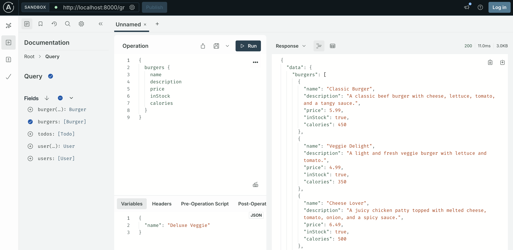

## GraphQL Code

### Clone Repository

```bash
git clone https://github.com/sadabnepal/graphql-full-stack-kit.git
cd graphql-full-stack-kit
```

### Pre-requisite
[](https://nodejs.org/en/download/)

### Install Packages
```
npm install
```

### Start Server
```
npm start
```

### Graphical View
```
http://localhost:8000/graphql
```

### GraphQl Server


### Sample Query:
```
query Burger($name: String!, $vegan: Boolean!) {
  burger (name: $name) {
    id
    name
    tomato
    cheese @skip(if: $vegan)
    inStock
    price
  }
}


variable

{
  "vegan": false,
  "name": "Veggie Delight"
}

```


### TODO:
- Implement Burger concept in graphql query and mutation
- Refer https://hygraph.com/blog/graphql-vs-rest-apis 

```
{
  burgers(where: { name: "cheeseburger"})
        name 
        description 
        price 
        calories   
        inStock 
}
```
